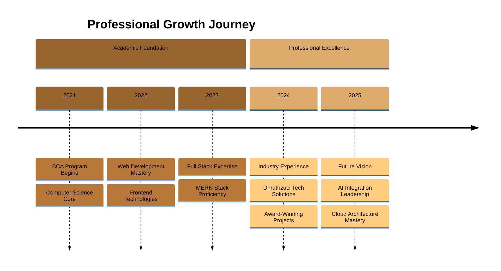

  

  

  

---

## 🌟 Professional Overview

<table>
<tr>
<td width="65%">

### 👋 **Meet Lalith**

I'm a dedicated **Full Stack Developer** and **AI Engineering Enthusiast** passionate about crafting innovative digital experiences. With a strong academic foundation from Bangalore North University (CGPA: **8.5/10**) and hands-on industry experience, I bring both technical expertise and creative problem-solving to every project.

**Current Role:** Developer Intern @ Dhruthzuci Tech Solutions  
**Location:** Bangalore, Karnataka, India  
**Education:** Bachelor of Computer Applications  
**Passion:** Creating AI-powered solutions that make a difference

### 💫 **My Mission**
Transforming ideas into powerful, scalable applications while continuously learning and adapting to emerging technologies in the ever-evolving tech landscape.

</td>
<td width="35%">

  
  
    
  
  

</td>
</tr>
</table>

---

## 🛠️ Technology Expertise

<table>
<tr>
<td align="center" width="25%">
<h3>🎨 Frontend</h3>
 
Building beautiful, responsive user interfaces
</td>
<td align="center" width="25%">
<h3>⚙️ Backend</h3>
 
Crafting robust server-side solutions
</td>
<td align="center" width="25%">
<h3>☁️ Cloud & DevOps</h3>
 
Deploying scalable cloud applications
</td>
<td align="center" width="25%">
<h3>🔧 Tools & Design</h3>
 
Streamlining development workflow
</td>
</tr>
</table>

### **Programming Languages**

---

## 📊 Development Journey

  
  

  

---

## 🚀 Featured Project Showcase

### 🤖 **Tutor AI - Intelligent Learning Assistant**
*AI-powered PDF-based educational platform that revolutionizes student learning*
- **Tech Stack:** React • Node.js • MongoDB • OpenAI API
- **Impact:** Enhanced learning efficiency through intelligent content analysis
- **Features:** PDF processing, AI-driven Q&A, personalized learning paths

### 📋 **E-Attendance Management System**
*Comprehensive attendance tracking solution for educational institutions*
- **Tech Stack:** React • Node.js • MySQL • Bootstrap
- **Impact:** Automated attendance tracking with 99% accuracy
- **Features:** Real-time reporting, analytics dashboard, mobile-responsive design

### 👥 **Intern Management Platform**
*Professional check-in/checkout system with advanced monitoring capabilities*
- **Tech Stack:** React • Express.js • MongoDB • JWT Authentication
- **Impact:** Streamlined intern management processes
- **Features:** Secure authentication, real-time monitoring, performance analytics

### 🎫 **Employee Support Ticketing System**
*Internal issue tracking platform with priority management*
- **Tech Stack:** React • Tailwind CSS • Node.js • Supabase
- **Impact:** Reduced issue resolution time by 40%
- **Features:** Priority management, status tracking, automated notifications

---

## 🏆 Professional Achievements

<table>
<tr>
<td width="50%" align="center">

### 🎖️ **Recognition & Awards**
 
🥇 **Best Website Award**  
*Achieved 50% increase in platform engagement*

🏅 **Logo Design Champion**  
*1st Place Winner - June 2024*

🚀 **Hackathon Finalist**  
*Coding Challenge Winner - April 2024*

⭐ **Academic Excellence**  
*Outstanding Student - Computer Applications*

</td>
<td width="50%" align="center">

### 📜 **Professional Certifications**
 
☁️ **Microsoft Azure Fundamentals (AZ-900)**  
*Cloud computing and Azure services expertise*

🌩️ **AWS Cloud Practitioner**  
*Amazon Web Services fundamentals*

💼 **NASSCOM Certified**  
*Soft Skills & Professional Communication*

⚛️ **Meta Certified**  
*Advanced React Development*

</td>
</tr>
</table>

---

## 📈 Career Timeline

---

## 🎓 Educational Excellence

<table width="80%">
<tr>
<td align="center">
<h3>🏛️ Academic Background</h3>
 
<h4><strong>Bachelor of Computer Applications (BCA)</strong></h4>

<strong>Bangalore North University</strong> | 2021 - 2024

<h3 style="color: #D4A574;">CGPA: 8.5/10</h3>

<em>Specialization in Application Development & System Design</em>

 

<strong>Core Subjects:</strong> Data Structures • Database Management • Web Technologies • Software Engineering • Computer Networks • Operating Systems

</td>
</tr>
</table>

---

## 💼 Professional Experience

<table width="90%">
<tr>
<td>
<h3>🚀 Developer Intern | Dhruthzuci Tech Solutions</h3>

<strong>Duration:</strong> October 2024 - February 2025

 
<h4>Key Contributions & Achievements:</h4>
<ul align="left">
<li>🎯 <strong>Full Stack Development:</strong> Built and deployed 4+ production-ready applications using MERN stack</li>
<li>📊 <strong>Performance Optimization:</strong> Increased user engagement by 50% through innovative UI/UX design</li>
<li>🤖 <strong>AI Integration:</strong> Implemented machine learning capabilities in educational platforms</li>
<li>⚡ <strong>System Optimization:</strong> Enhanced application performance and optimized database queries</li>
<li>👥 <strong>Team Collaboration:</strong> Worked with cross-functional teams using Agile development methodologies</li>
<li>🏆 <strong>Recognition:</strong> Received Best Website Award for outstanding contribution to platform development</li>
</ul>
</td>
</tr>
</table>

---

## 🌟 Core Competencies & Skills

<table width="95%">
<tr>
<td width="33%" align="center">
<h3>💻 Technical Excellence</h3>
 
• Full Stack Web Development 
• AI/ML Integration 
• Database Design & Optimization 
• RESTful API Development 
• Cloud Architecture 
• Version Control (Git) 
• Responsive Web Design 
• Performance Optimization
</td>
<td width="33%" align="center">
<h3>🧠 Professional Skills</h3>
 
• Problem-Solving & Analytics 
• Project Management 
• Team Leadership 
• Technical Documentation 
• Code Review & Quality Assurance 
• Agile Development 
• Client Communication 
• Continuous Learning
</td>
<td width="33%" align="center">
<h3>🛠️ Development Tools</h3>
 
• Visual Studio Code 
• Git & GitHub 
• Docker & Containerization 
• Postman API Testing 
• Figma UI/UX Design 
• MongoDB Compass 
• Azure DevOps 
• Netlify & Vercel
</td>
</tr>
</table>

---

## 🎯 What Sets Me Apart

<table width="90%">
<tr>
<td width="50%">
<h3>🚀 Innovation Mindset</h3>

Constantly exploring cutting-edge technologies and implementing creative solutions that push boundaries and deliver exceptional user experiences.

 
<h3>🤝 Collaborative Spirit</h3>

Strong believer in teamwork and knowledge sharing, contributing to open-source projects and mentoring fellow developers.

</td>
<td width="50%">
<h3>📚 Continuous Learner</h3>

Committed to staying updated with the latest industry trends, earning certifications, and expanding skillset through hands-on practice.

 
<h3>🎨 Quality Focus</h3>

Dedicated to writing clean, maintainable code and creating intuitive user interfaces that provide seamless experiences.

</td>
</tr>
</table>

---

## 📞 Let's Connect & Build Something Amazing

### **Ready to collaborate on your next big project?**

 

  

**📧 Contact:** lalithkish2004@gmail.com  
**📍 Location:** Bangalore, Karnataka, India  
**🎯 Available for:** Full-time opportunities • Freelance projects • Technical collaborations  
**💡 Expertise:** AI-powered applications • Full-stack development • Cloud solutions

 

### **"Code is poetry written in logic, and I'm here to compose digital symphonies."**

---

  

 

  

  

