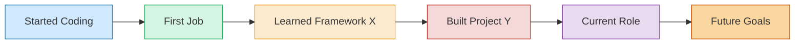

# Hi there, I'm [Your Name] 👋

  

## 👨‍💻 Software Engineer | Problem Solver | Continuous Learner

> *"Code is like humor. When you have to explain it, it's bad."* — Cory House

  &nbsp;&nbsp;
  &nbsp;&nbsp;
  &nbsp;&nbsp;
  

---

### 🚀 About Me

I'm a passionate software developer with a love for creating clean, efficient, and impactful solutions. With a background in [your background], I blend technical expertise with creative problem-solving to build software that makes a difference.

- 🔭 I'm currently working on **[Current Project]**
- 🌱 I'm currently learning **[Technology/Skill]**
- 👯 I'm looking to collaborate on **open source projects**
- 💬 Ask me about **[Your Areas of Expertise]**
- ⚡ Fun fact: **[Interesting Fact About You]**

---

### 🛠️ Languages & Tools

  &nbsp;&nbsp;
  &nbsp;&nbsp;
  &nbsp;&nbsp;
  &nbsp;&nbsp;
  &nbsp;&nbsp;
  &nbsp;&nbsp;
  &nbsp;&nbsp;
  

<!-- Add or replace with technologies you actually use -->

---

### 📊 GitHub Stats

  
  

---

### 🏆 Projects

<table>
  <tr>
    <td width="50%">
      <h3 align="center">Project 1</h3>
      

        
        

          
          
        

        
<strong>Technologies Used:</strong> React, Node.js, MongoDB

        
Brief description of what this project does and what you learned making it.

      

    </td>
    <td width="50%">
      <h3 align="center">Project 2</h3>
      

        
        

          
          
        

        
<strong>Technologies Used:</strong> TypeScript, Express, PostgreSQL

        
Brief description of what this project does and what you learned making it.

      

    </td>
  </tr>
</table>

---

### 📈 My Coding Journey

---

### 📚 Latest Blog Posts
<!-- BLOG-POST-LIST:START -->
- [How I Solved X Problem With Y Technology](https://yourblog.com/post1)
- [Best Practices for Clean Code](https://yourblog.com/post2)
- [My Journey Learning Z](https://yourblog.com/post3)
<!-- BLOG-POST-LIST:END -->

---

### 🎯 Current Focus

I'm currently focused on deepening my knowledge of [specific technologies or concepts], with a particular interest in [specific area]. I'm also exploring opportunities to contribute to open-source projects that align with my values of [your values, e.g., sustainability, accessibility, education].

---

  

  <h3>💻 Happy coding! 💻</h3>

