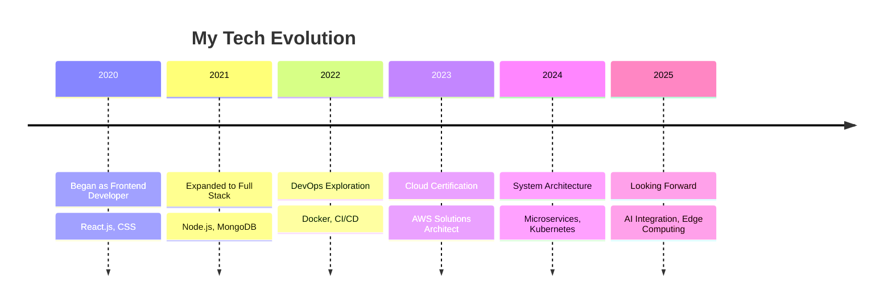

  

  

  

## 💫 About Me

  

I'm a passionate technologist with a love for building scalable systems and elegant solutions to complex problems. With a blend of creative thinking and technical expertise, I transform ideas into reality through code.

- 🔭 **Current Focus:** Building next-generation cloud-native applications
- 🌱 **Learning:** Kubernetes, Terraform, and advanced system design patterns
- 👯 **Collaboration:** Open to working on innovative open-source projects 
- 💬 **Ask Me About:** React, Node.js, AWS, Cloud Architecture, and DevOps
- 📫 **Contact:** [youremail@example.com](mailto:youremail@example.com)
- ⚡ **Fun Fact:** I can solve a Rubik's cube while writing code. Multitasking at its finest!

  
  
  
  
  

## 🚀 Tech Universe

<table align="center">
  <tr>
    <td valign="top" width="33%">
      <h3 align="center">Frontend Wizardry</h3>
      

        
        
        
        
        
      

       
      

       
      

        
Crafting pixel-perfect, responsive, and accessible user interfaces

      

    </td>
    <td valign="top" width="33%">
      <h3 align="center">Backend Alchemy</h3>
      

        
        
        
        
        
      

       
      

       
      

        
Building robust APIs and scalable microservices architectures

      

    </td>
    <td valign="top" width="33%">
      <h3 align="center">Cloud & DevOps</h3>
      

        
        
        
        
        
      

       
      

       
      

        
Orchestrating infrastructure and automating deployment pipelines

      

    </td>
  </tr>
  <tr>
    <td valign="top" width="33%">
      <h3 align="center">Database Mastery</h3>
      

        
        
        
        
        
      

       
      

       
      

        
Designing optimal data models and query optimization strategies

      

    </td>
    <td valign="top" width="33%">
      <h3 align="center">Essential Tools</h3>
      

        
        
        
        
        
      

       
      

       
      

        
Maximizing productivity with cutting-edge development tools

      

    </td>
    <td valign="top" width="33%">
      <h3 align="center">Monitoring & Security</h3>
      

        
        
        
        
        
      

       
      

       
      

        
Implementing observability and securing systems at scale

      

    </td>
  </tr>
</table>

## 📊 GitHub Analytics

  
  

  
  

  

## 🌟 Featured Projects

  <table>
    <tr>
      <td width="50%">
        <h3 align="center">Project Alpha</h3>
        

          
          

            
            
          

          
<strong>React · Node.js · MongoDB · AWS</strong>

          
A cutting-edge e-commerce platform with real-time inventory management and ML-powered recommendations.

        

      </td>
      <td width="50%">
        <h3 align="center">Project Omega</h3>
        

          
          

            
            
          

          
<strong>Next.js · TypeScript · GraphQL · Docker</strong>

          
A serverless SaaS dashboard with CI/CD pipeline and microservices architecture.

        

      </td>
    </tr>
    <tr>
      <td width="50%">
        <h3 align="center">Project Delta</h3>
        

          
          

            
            
          

          
<strong>Python · FastAPI · PostgreSQL · Kubernetes</strong>

          
A scalable data analytics platform with real-time dashboards and automated reporting.

        

      </td>
      <td width="50%">
        <h3 align="center">Project Sigma</h3>
        

          
          

            
            
          

          
<strong>Go · Redis · gRPC · Terraform</strong>

          
High-performance API gateway with advanced caching, rate limiting, and circuit breaking capabilities.

        

      </td>
    </tr>
  </table>

## 📈 Professional Journey

## 📝 Latest Blog Posts

  <!-- BLOG-POST-LIST:START -->
  
  
  
  <!-- BLOG-POST-LIST:END -->

## ✨ What I'm Focusing On

  

I'm currently diving deeper into **serverless architectures** and **edge computing** to build faster, more resilient applications. I'm passionate about integrating **DevSecOps practices** to build secure-by-design systems and exploring how **AI/ML** can enhance developer productivity.

My mission is to create technology that solves real-world problems while maintaining a focus on user experience, performance, and security.

  
  
  

  

