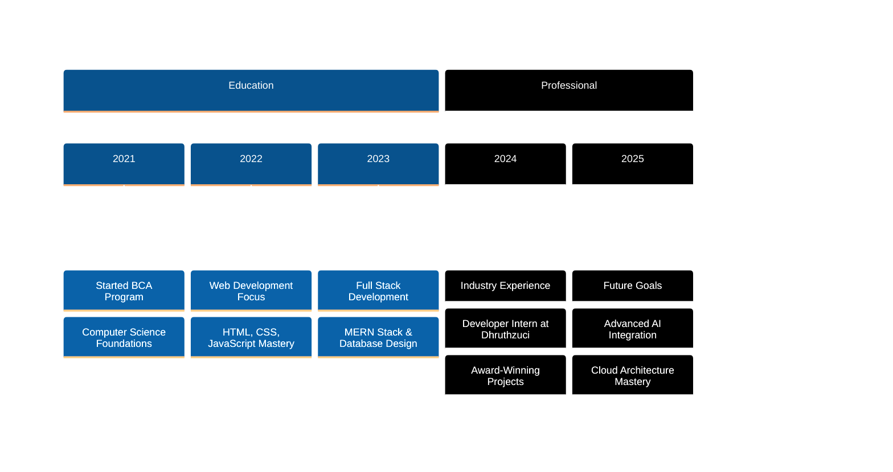

  

  

  

---

## 🎯 Professional Summary

<table>
<tr>
<td width="60%">

### 👨‍💻 **Who I Am**

I'm a passionate **Full Stack Developer** and **AI Engineering Enthusiast** with a proven track record of building innovative digital solutions. Currently pursuing BCA at Bangalore North University with an impressive **8.5/10 CGPA**.

**🚀 Current Role:** Developer Intern @ Dhruthzuci Tech Solutions  
**📍 Location:** Bangalore, India  
**🎓 Education:** BCA Graduate - Bangalore North University  
**💡 Specialization:** AI-powered web applications & educational technology

</td>
<td width="40%">

  

</td>
</tr>
</table>

### 🎯 **What I Do**
- 🔧 Build scalable full-stack applications using modern technologies
- 🤖 Integrate AI/ML capabilities into web applications
- ☁️ Deploy applications on cloud platforms (AWS, Azure)
- 📱 Create responsive, user-centric interfaces
- 🛠️ Develop efficient APIs and database solutions

---

## 🛠️ Technology Arsenal

### **Frontend Development**

### **Backend & Database**

### **Cloud & DevOps**

### **Programming Languages**

---

## 📊 GitHub Analytics Dashboard

  
  

  

---

## 🚀 Featured Projects Portfolio

| Project | Tech Stack | Links | Description |
|---------|------------|-------|-------------|
| **🤖 Tutor AI** | React · Node.js · MongoDB · OpenAI API |   | AI-powered PDF-based educational assistant that enhances student learning through intelligent content analysis |
| **📋 E-Attendance System** | React · Node.js · MySQL · Bootstrap |   | Comprehensive attendance management solution with automated tracking and reporting |
| **👥 Intern Management System** | React · Express.js · MongoDB · JWT |   | Zoho-like check-in/checkout application with secure authentication and real-time monitoring |
| **🎫 Employee Ticketing Platform** | React · Tailwind CSS · Node.js · Supabase |   | Internal support ticket system with priority management and issue tracking |

---

## 🏆 Achievements & Recognition

<table>
<tr>
<td width="50%">

### 🎖️ **Awards & Honors**
- 🥇 **Best Website Award** - Increased platform engagement by 50%
- 🏅 **Logo Design Competition Winner** - 1st Place (June 2024)
- 🚀 **Coding Challenge Winner** - Hackathon Finalist (April 2024)
- ⭐ **Outstanding Student** - Department of Computer Applications

</td>
<td width="50%">

### 📜 **Professional Certifications**
- ☁️ **Microsoft Azure Fundamentals (AZ-900)**
- 🌩️ **AWS Cloud Practitioner**
- 💼 **Soft Skills & Communication** - NASSCOM
- ⚛️ **Advanced React Development** - Meta

</td>
</tr>
</table>

---

## 📈 Professional Timeline

---

## 🎓 Education & Learning

### **Bachelor of Computer Applications (BCA)**
**Bangalore North University** | 2021 - 2024 | **CGPA: 8.5/10**

**Specialization:** Application Development & System Design

**Key Coursework:** Data Structures, Database Management, Web Technologies, Software Engineering

---

## 💼 Professional Experience

### **Developer Intern** | Dhruthzuci Tech Solutions
*October 2024 - February 2025*

- 🚀 Developed and deployed 4+ full-stack applications using MERN stack
- 📈 Increased user engagement by 50% through innovative UI/UX design
- 🤖 Integrated AI capabilities into educational platforms
- ⚡ Optimized application performance and database queries
- 👥 Collaborated with cross-functional teams using Agile methodologies

---

## 🌟 Core Competencies

| **Technical Skills** | **Soft Skills** | **Tools & Platforms** |
|:---:|:---:|:---:|
| Full Stack Development | Problem Solving | VS Code, Git, Docker |
| AI/ML Integration | Team Leadership | AWS, Azure, Netlify |
| Database Design | Communication | Postman, Figma, Jira |
| API Development | Project Management | MongoDB, MySQL, Supabase |
| Cloud Architecture | Adaptability | React, Node.js, Express |

---

## 📞 Let's Connect & Collaborate

### **Ready to build something amazing together?**

 

**📧 Email:** lalithkish2004@gmail.com  
**📱 Open for:** Full-time opportunities, Freelance projects, Collaborations  
**🎯 Specializing in:** AI-powered web applications, Full-stack development, Cloud solutions

---

  

  

  

