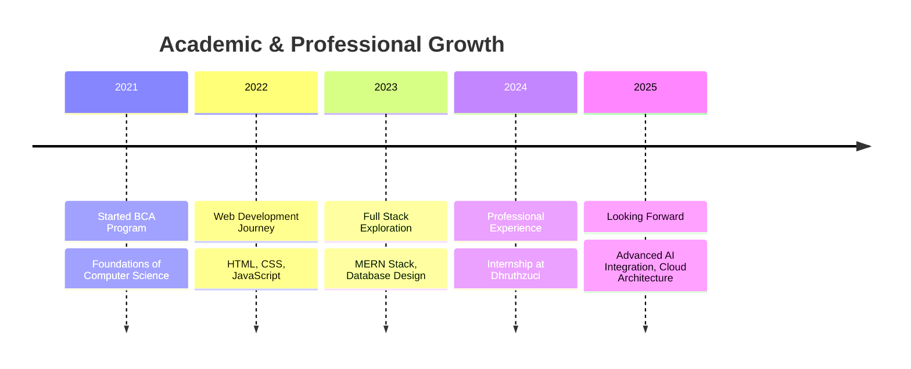

  

  

  

## 💫 About Me

  

I'm a passionate technologist with a focus on building innovative solutions at the intersection of full-stack development and artificial intelligence. Currently completing my Bachelor of Computer Applications at Bangalore North University with a CGPA of 8.5/10.

- 💼 **Experience:** Developer Intern @ Dhruthzuci Tech Solutions (Oct 2024 – Feb 2025)
- 🔭 **Current Focus:** AI-powered web applications and educational technology
- 🌱 **Learning:** Cloud architecture, system design, and advanced AI/ML concepts
- 👯 **Collaboration:** Open to working on innovative open-source projects 
- 📫 **Contact:** [lalithkish2004@gmail.com](mailto:lalithkish2004@gmail.com)
- ⚡ **Fun Fact:** Striving to innovate with code and build smart, scalable systems through continuous learning and AI.

  
  
  
  

## 🚀 Tech Universe

<table align="center">
  <tr>
    <td valign="top" width="33%">
      <h3 align="center">Frontend Development</h3>
      

        
        
        
        
        
      

       
      

       
      

        
Building responsive, user-friendly interfaces with modern frameworks

      

    </td>
    <td valign="top" width="33%">
      <h3 align="center">Backend Development</h3>
      

        
        
        
        
        
      

       
      

       
      

        
Crafting robust APIs and server-side applications

      

    </td>
    <td valign="top" width="33%">
      <h3 align="center">Database & Tools</h3>
      

        
        
        
        
        
      

       
      

       
      

        
Managing data effectively and streamlining development workflows

      

    </td>
  </tr>
  <tr>
    <td valign="top" width="33%">
      <h3 align="center">Programming Languages</h3>
      

        
        
        
        
        
      

       
      

       
      

        
Versatile programming expertise across multiple languages

      

    </td>
    <td valign="top" width="33%">
      <h3 align="center">Cloud & Deployment</h3>
      

        
        
        
        
        
      

       
      

       
      

        
Deploying applications with modern cloud services

      

    </td>
    <td valign="top" width="33%">
      <h3 align="center">Education & Growth</h3>
      

        
        
        
        
        
      

       
      

       
      

        
Continuous learning through certifications and education

      

    </td>
  </tr>
</table>

## 📊 GitHub Analytics

  
  

  
  

## 🌟 Featured Projects

  <table>
    <tr>
      <td width="50%">
        <h3 align="center">Tutor AI</h3>
        

          
          

            
            
          

          
<strong>React · Node.js · MongoDB · OpenAI API</strong>

          
An AI-powered PDF-based educational assistant for students that enhances learning through intelligent content analysis.

        

      </td>
      <td width="50%">
        <h3 align="center">E-Attendance System</h3>
        

          
          

            
            
          

          
<strong>React · Node.js · MySQL · Bootstrap</strong>

          
Online college attendance management tool with automated tracking and comprehensive reporting capabilities.

        

      </td>
    </tr>
    <tr>
      <td width="50%">
        <h3 align="center">Intern Management System</h3>
        

          
          

            
            
          

          
<strong>React · Express.js · MongoDB · JWT Authentication</strong>

          
A Zoho-like check-in/checkout app for interns with secure login and real-time monitoring capabilities.

        

      </td>
      <td width="50%">
        <h3 align="center">Employee Ticketing Platform</h3>
        

          
          

            
            
          

          
<strong>React · Tailwind CSS · Node.js · Supabase</strong>

          
A React-based support ticket site for internal issue tracking and resolution with priority management.

        

      </td>
    </tr>
  </table>

## 🏆 Achievements & Certifications

  <table width="100%">
    <tr>
      <td width="50%">
        <h3 align="center">🏆 Achievements</h3>
        

          
🥇 <strong>Best Website Award</strong> Increased platform engagement by 50%

          
🥇 <strong>Logo Design Winner</strong> 1st place, June 2024

          
🏅 <strong>Coding Challenge Winner</strong> Hackathon Finalist, April 2024

          
🌟 <strong>Outstanding Student</strong> Department of Computer Applications

        

      </td>
      <td width="50%">
        <h3 align="center">📜 Certifications</h3>
        

          
 <strong>Microsoft Azure Fundamentals (AZ-900)</strong>

          
 <strong>AWS Cloud Practitioner</strong>

          
 <strong>Soft Skills & Communication</strong> – NASSCOM

          
 <strong>Advanced React Development</strong> – Meta

        

      </td>
    </tr>
  </table>

## 📈 My Learning Journey

## 🎓 Education

  <table width="100%">
    <tr>
      <td align="center">
        <h3>Bachelor of Computer Applications (BCA)</h3>
        
<strong>Bangalore North University</strong> 2021 - 2024

        
CGPA: 8.5/10

        
Specialized in Application Development & System Design

        
      </td>
    </tr>
    <tr>
      <td align="center">
        <h3>Technical Courses & Workshops</h3>
        
🔹 Full Stack Development Bootcamp

        
🔹 AI & Machine Learning Fundamentals

        
🔹 Cloud Computing & DevOps Workshop

        
🔹 Agile Development Methodology Training

      </td>
    </tr>
  </table>

  

  
  

  <h3>📫 Connect With Me</h3>
  
  
  
  

  

